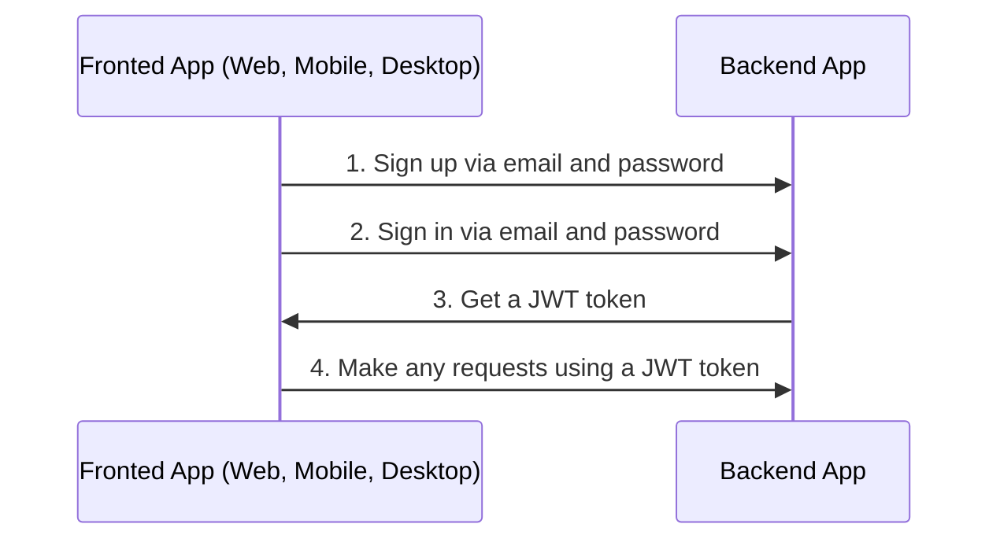
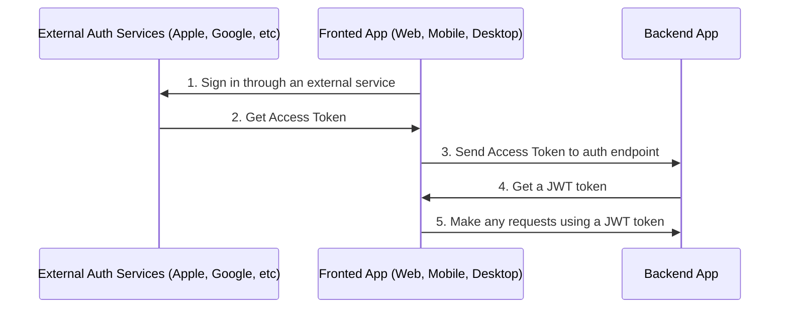

## Quick run

```bash
cp env-example .env
docker compose up -d
```

For check status run

```bash
docker compose logs
```

## Comfortable development

```bash
cp env-example .env
```

Change `DATABASE_HOST=postgres` to `DATABASE_HOST=localhost`

Change `MAIL_HOST=maildev` to `MAIL_HOST=localhost`

Run additional container:

```bash
docker compose up -d postgres adminer maildev
```

```bash
npm install

npm run migration:run

npm run seed:run

npm run start:dev
```

## Links

- Swagger: <http://localhost:3000/docs>
- Adminer (client for DB): <http://localhost:8080>
- Maildev: <http://localhost:1080>

## Automatic update of dependencies

If you want to automatically update dependencies, you can connect [Renovate](https://github.com/marketplace/renovate) for your project.

## Database utils

Generate migration

```bash
npm run migration:generate -- src/database/migrations/CreateNameTable
```

Run migration

```bash
npm run migration:run
```

Revert migration

```bash
npm run migration:revert
```

Drop all tables in database

```bash
npm run schema:drop
```

Run seed

```bash
npm run seed:run
```

## Tests

```bash
# unit tests
npm run test

# e2e tests
npm run test:e2e
```

## Tests in Docker

```bash
docker compose -f docker-compose.ci.yaml --env-file env-example -p ci up --build --exit-code-from api && docker compose -p ci rm -svf
```

## Test benchmarking

```bash
docker run --rm jordi/ab -n 100 -c 100 -T application/json -H "Authorization: Bearer USER_TOKEN" -v 2 http://<server_ip>:3000/api/v1/users
```

### Auth via email flow

By default boilerplate used sign in and sign up via email and password.



### Auth via external services or social networks flow

Also you can sign up via another external services or social networks like Apple, Facebook, Google, and Twitter.



For auth with external services or social networks you need:

1. Sign in through an external service and get access token(s).
2. Call one of endpoints with access token received in frontend app on 1-st step and get JWT token from the backend app.

   ```text
   POST /api/v1/auth/facebook/login

   POST /api/v1/auth/google/login

   POST /api/v1/auth/twitter/login

   POST /api/v1/auth/apple/login
   ```

3. Make any requests using a JWT token
